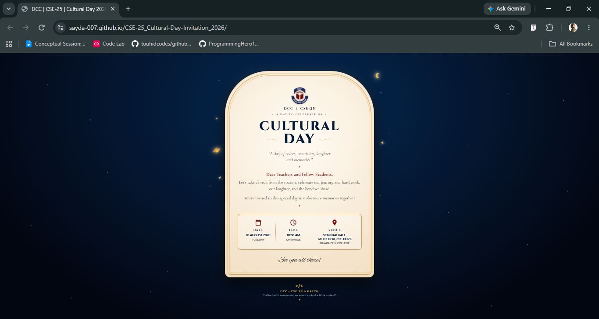
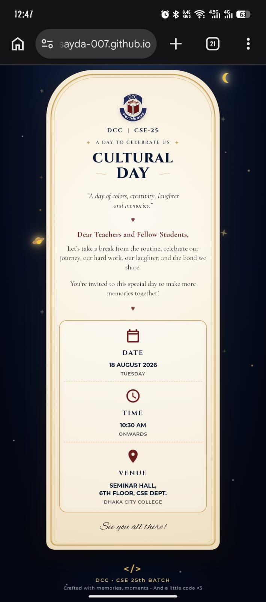

# 🌙 CSE-25 | Cultural Day 2026
### A Digital Invitation for a Day of Colors, Creativity & Memories

CSE-25 Cultural Day is a responsive digital invitation card created for the **CSE 25th Batch of Dhaka City College**.
The project combines a dark celestial theme, glowing details, and a clean event-information layout to create a memorable digital invitation.

🌐 **[Visit Website](https://sayda-007.github.io/CSE-25_Cultural-Day-Invitation_2026/)**

* * *

## ✨ About the Project

This project is a digital invitation designed for the **CSE-25 Cultural Day 2026** at Dhaka City College.
The design uses a **dark space-inspired background** with glowing golden elements, Saturn, a crescent moon, and structured event details to create a festive and elegant invitation experience.
The invitation presents the event information in a simple and visually engaging way while keeping the design responsive across different screen sizes.

* * *

## 🎯 Features

### 🌌 Celestial Design

The invitation features:

- Dark starry background
- 🪐 Saturn illustration
- 🌙 Crescent moon
- ✨ Glowing decorative elements
- Golden glowing card border
- CSE-25 and DCC branding

### 📅 Event Information

The invitation clearly displays:

- 📅 Event date
- 🕐 Event time
- 📍 Event venue
- 🎉 Cultural Day title
- 🎓 CSE-25 batch information

### 🎨 Visual Details

The design includes:

- Two-color **Cultural Day** typography
- Decorative wave element
- Custom event information cards
- SVG icons
- Responsive spacing and positioning
- Footer branding

### 📱 Responsive Design

The invitation is designed for different screen sizes with:

- Responsive event cards
- Mobile-friendly layout
- Flexible typography
- Responsive decorative elements
- Adjusted spacing for smaller screens

* * *

## 🛠️ Technologies Used

- 

- 

* * *

## 🖼️ Project Preview

<table>
<tr>

<td width="50%" valign="top">

### 🖥️ Desktop

  

</td>

<td width="50%" valign="top">

### 📱 Mobile

  

</td>

</tr>
</table>

* * *

## 💡 What I Practiced

Building this project helped me practice:

- Creating a complete webpage from scratch
- Structuring content with HTML
- Styling layouts with CSS
- Working with SVG assets
- Using CSS positioning
- Creating glowing visual effects
- Designing responsive layouts
- Working with custom icons and illustrations
- Organizing project assets
- Deploying a website with GitHub Pages

* * *

